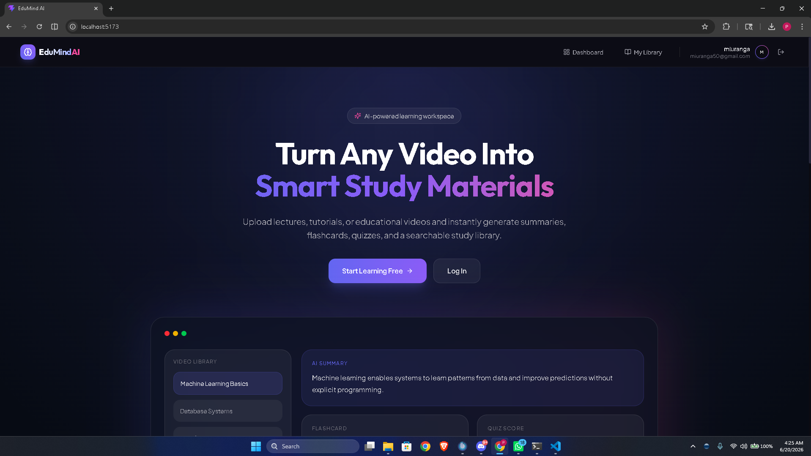
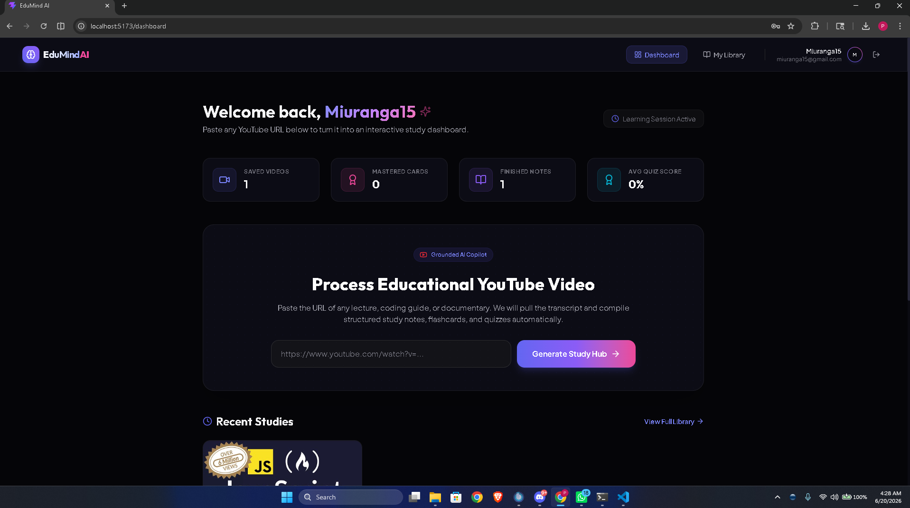
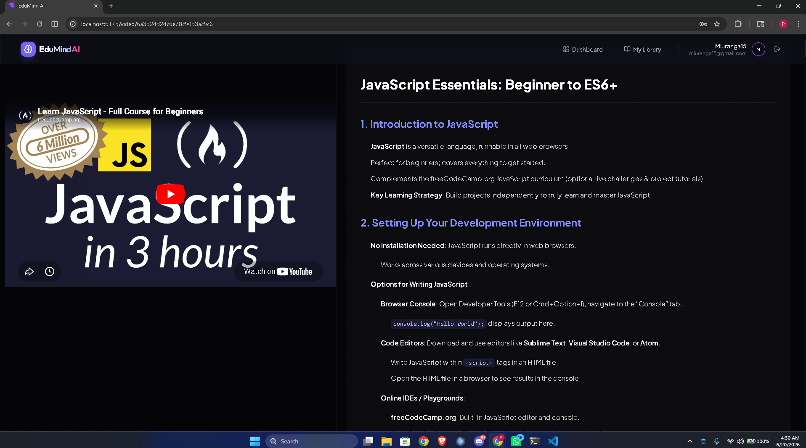
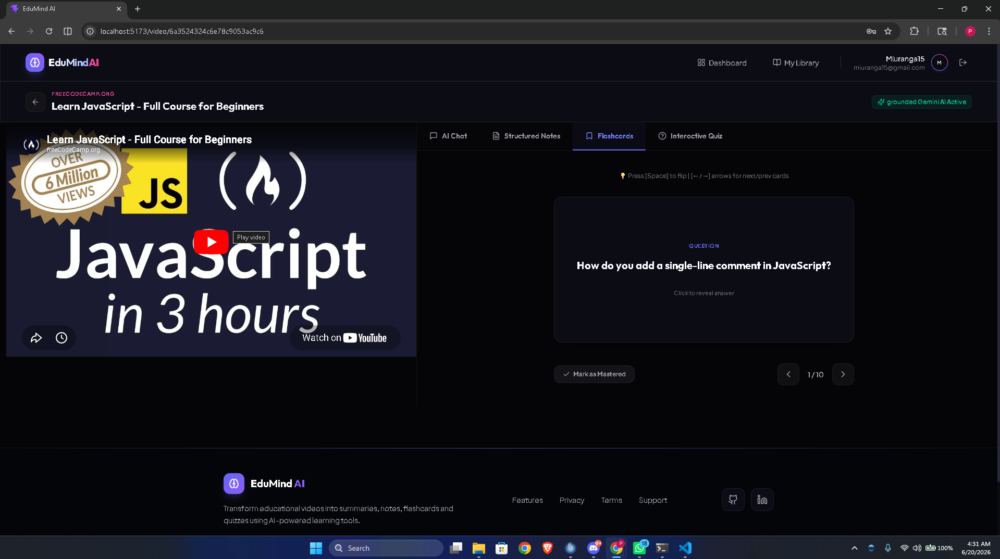
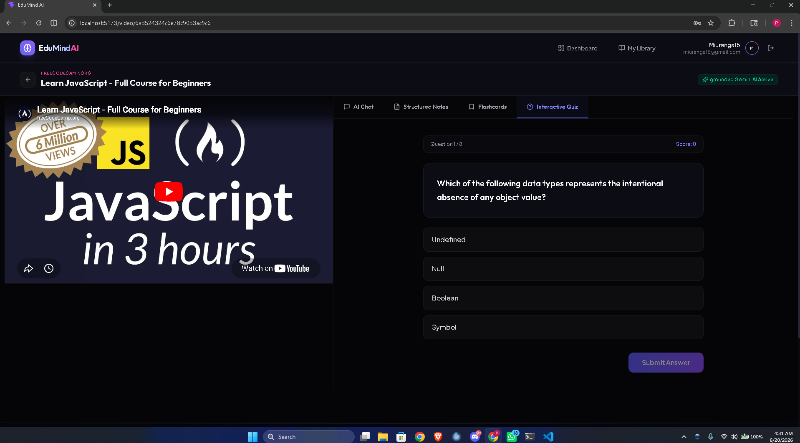
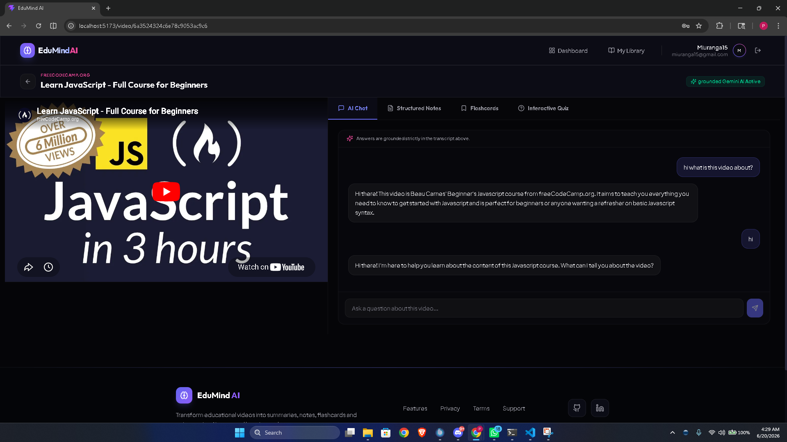

<div align="center">

<h1>🚀 EduMind AI</h1>

<h3>AI-Powered Study Assistant</h3>

<p>
Transform YouTube educational videos into intelligent study materials using AI.
</p>

<p>
📝 Summaries • 📚 Notes • 🎴 Flashcards • ❓ Quizzes • 💬 AI Chat
</p>

</div>

---

## 🌟 Overview

EduMind AI is a full-stack AI-powered learning platform that helps students learn more effectively from YouTube educational content.

Simply paste a YouTube video URL and EduMind AI automatically extracts the transcript, analyzes the content using AI, and generates interactive study materials to improve learning and retention.

---

## ✨ Features

### 📺 YouTube Video Processing

* Extracts video transcripts automatically
* Processes educational content in seconds

### 📝 AI-Powered Summaries

* Generates concise summaries of lengthy videos
* Highlights key concepts and important points

### 📚 Smart Study Notes

* Creates structured notes for efficient learning
* Organizes information into easy-to-review sections

### 🎴 Interactive Flashcards

* Generates flashcards from video content
* Supports active recall learning techniques

### ❓ AI Quiz Generation

* Creates quiz questions automatically
* Helps evaluate understanding and retention

### 💬 AI Chat Assistant

* Ask questions about the video content
* Receive context-aware AI responses

### 🔐 User Authentication

* Secure login and registration
* Personalized learning experience

---

## 🖼️ Screenshots

### 🏠 Home Page



---

### 📊 Dashboard



---

### 📝 AI Notes



---

### 🎴 Flashcards



---

### ❓ Quiz Generation



---

### 💬 AI Chat Assistant



---

## 🛠️ Tech Stack

### Frontend

* React.js
* Tailwind CSS
* React Router

### Backend

* Node.js
* Express.js

### Database

* MongoDB

### AI Integration

* Google Gemini AI

### Authentication

* JWT Authentication

---

## ⚙️ Installation

### Clone Repository

```bash
git clone https://github.com/miyuranga-dev/EduMind-AI.git
cd EduMind-AI
```

### Backend Setup

```bash
cd server
npm install
```

Create a .env file:

```env
MONGODB_URI=your_mongodb_uri
JWT_SECRET=your_jwt_secret
GEMINI_API_KEY=your_gemini_api_key
```

Run Backend:

```bash
npm run server
```

### Frontend Setup

```bash
cd client
npm install
npm run dev
```

---

## 🎯 Learning Outcomes

Through this project, I gained experience in:

* Full-Stack MERN Development
* REST API Design
* AI Integration with Gemini AI
* Authentication & Authorization
* MongoDB Database Management
* Responsive UI Development
* Modern Software Engineering Practices

---

## 🎥 Project Demo

Watch the project demo on YouTube:

https://youtu.be/AG97Fq0QToo?si=svAojhSCaZt_3hem

---

## 👨‍💻 Developer

Miyuranga

GitHub:
https://github.com/miyuranga-dev

LinkedIn:
https://www.linkedin.com/in/miyuranga-dev/

---

## ⭐ Support

If you found this project interesting, consider giving it a star on GitHub!

It helps support the project and motivates future development.

---

<div align="center">

Made with ❤️ using React, Node.js, MongoDB & Gemini AI

</div>
