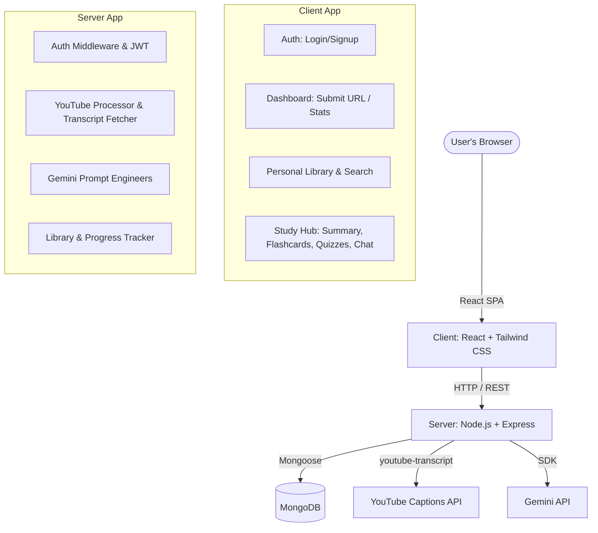

# Implementation Plan - EduMind AI Platform

EduMind AI is a full-stack, AI-powered learning platform that transforms YouTube educational videos into interactive study materials including transcripts, summaries, notes, interactive flashcards, quizzes, and a grounded AI chat assistant.

---

## User Review Required

> [!IMPORTANT]
> Since we are building this project from scratch, please review the technology choices and the step-by-step plan below. Once approved, we will start building Step 1.

> [!WARNING]
> You will need to provide a **Gemini API Key** and a **MongoDB connection URI** for the backend to function. We will set these up in a `.env` file in the server directory.

---

## Open Questions

> [!IMPORTANT]
> Please answer the following questions to help refine the implementation:
> 1. **Tailwind CSS Version**: Do you prefer **Tailwind CSS v4** (newest, CSS-first configuration, ultra-fast) or **Tailwind CSS v3** (classic, config-file based)? *(Recommended: Tailwind CSS v4)*
> 2. **TypeScript**: Do you prefer the frontend/backend to be written in **TypeScript** or standard **JavaScript (ES Modules)**? *(Recommended: TypeScript for frontend, ES Modules JavaScript for backend)*
> 3. **Package Manager**: Do you want to use **npm** or **yarn / pnpm**? *(Recommended: npm)*

---

## Proposed Architecture & Tech Stack

### 1. Database Schema (MongoDB)
- **User**: Name, Email, Password (hashed), CreatedAt.
- **Video**: YouTube URL, Video ID, Title, Thumbnail, ChannelName, Duration, Transcript (array of `{ text, start, duration }`), CreatedBy (User ID), CreatedAt.
- **StudyMaterial**:
  - **Summary**: Concise high-level summaries.
  - **Notes**: Structured Markdown-formatted notes.
  - **Flashcards**: Array of `{ question, answer, mastered: boolean }`.
  - **Quizzes**: Array of `{ question, options: string[], correctAnswerIndex: number, explanation: string }`.
- **ChatHistory**: Array of messages per video per user for persistence.
- **UserProgress**: Tracks completed quizzes, percentage of flashcards mastered, and notes read progress.

### 2. Backend API Endpoints (Express)
- `POST /api/auth/register` & `POST /api/auth/login` - User registration and authentication.
- `GET /api/auth/me` - Fetch logged-in user profile.
- `POST /api/videos/process` - Accepts YouTube URL, extracts transcript, fetches metadata, runs Gemini analysis (summaries, notes, flashcards, quizzes), and saves to MongoDB.
- `GET /api/videos` - Get user's saved videos library (supports search, sort, and pagination).
- `GET /api/videos/:id` - Fetch video and generated study materials.
- `DELETE /api/videos/:id` - Delete video from personal library.
- `POST /api/videos/:id/chat` - Chat with AI grounded in this video's transcript.
- `PUT /api/videos/:id/progress` - Update progress (flashcard mastered state, quiz score, etc.).

### 3. Frontend Pages (React + Tailwind CSS)
- **Aesthetic**: Premium dark-mode-first dashboard with glassmorphism panels, indigo/violet/fuchsia gradient accents, smooth transitions, and high-quality micro-interactions.
- **Auth Page**: Login/Signup forms.
- **Dashboard**: Central URL input area with an interactive loading state (progress steps showing transcript fetching -> AI note generating -> quiz building).
- **Library Page**: Searchable grid of processed videos with thumbnail previews, tags, and progress rings.
- **Study Hub Page**:
  - Left Panel: Resizable video player & Interactive Transcript.
  - Right Panel: Tabbed workspace:
    - **Tab 1: AI Chat** - Chat bubble interface with grounding references.
    - **Tab 2: Notes** - Beautifully styled markdown viewer.
    - **Tab 3: Flashcards** - 3D card-flip animations with keyboard shortcuts and status tagging ("Mastered" / "Review Later").
    - **Tab 4: Quiz** - Gamified quiz interface with score tallies, immediate feedback animations, and detailed explanations.

---

## Step-by-Step Implementation Plan

### Phase 1: Project Initialization & Server Foundation
- **Step 1.1**: Initialize Node.js backend workspace in `server/`. Setup Express, mongoose, JWT, bcryptjs, cors, and dotenv.
- **Step 1.2**: Write MongoDB schemas (`User`, `Video`, `StudyMaterial`, `Progress`).
- **Step 1.3**: Implement Auth REST endpoints with token authentication (HTTP-only cookies or authorization header).

### Phase 2: YouTube & Gemini Core Engine
- **Step 2.1**: Implement backend utility to parse YouTube URLs, fetch video metadata, and extract video transcripts (using `youtube-transcript` or fallback scrapers).
- **Step 2.2**: Integrate Gemini API client. Write structured system prompts to generate high-quality summaries, formatted Markdown notes, structured JSON flashcards, and JSON quizzes.
- **Step 2.3**: Build the pipeline endpoint `/api/videos/process` which stitches these services together and stores results in the DB.

### Phase 3: Conversational AI Grounded in Video
- **Step 3.1**: Create chat endpoint `/api/videos/:id/chat`.
- **Step 3.2**: Implement context injection logic: feed the transcript blocks into the Gemini API model along with the chat history. Formulate safety and validation prompts to ensure responses *never* hallucinate facts outside the video context.

### Phase 4: Frontend Setup & Shell
- **Step 4.1**: Initialize React Vite app inside `client/`. Install Tailwind CSS and lucide-react icons.
- **Step 4.2**: Configure the modern theme (gradient palettes, glassmorphism card components, font loading).
- **Step 4.3**: Set up client state (Auth context, API service layers) and React Router.

### Phase 5: Client Dashboard & Video Processing
- **Step 5.1**: Build the Auth page with smooth validation.
- **Step 5.2**: Build the Main Dashboard page with YouTube URL submission, featuring a dynamic multi-step loading animation.
- **Step 5.3**: Build the Library view with search, filter, and delete controls.

### Phase 6: Interactive Study Hub Components
- **Step 6.1**: Implement the Video & Transcript viewer (syncing clickable transcript timestamps with the video player).
- **Step 6.2**: Implement the AI Chat workspace.
- **Step 6.3**: Implement the Notes markdown viewer with download capabilities.
- **Step 6.4**: Implement the 3D flipping Flashcard widget.
- **Step 6.5**: Implement the Quiz widget with visual progress tracking.

### Phase 7: Progress Tracking & Final Polish
- **Step 7.1**: Integrate backend progress endpoints to track completed content.
- **Step 7.2**: Connect progress to UI (dashboard progress charts, library progress rings).
- **Step 7.3**: Final styling polish, layout responsiveness checks, and bug fixes.

---

## Verification Plan

### Automated Verification
- We will set up validation test scripts in the `server` to check:
  - Database saving/loading of videos and study materials.
  - Transcript extraction correctness.
  - Gemini response schema parser parsing JSON without errors.
- Client build validation using `npm run build`.

### Manual UI Verification
- Interact with the dashboard to submit YouTube URLs.
- Test responsive behavior from mobile screens to 4K monitors.
- Inspect network calls to ensure tokens are securely sent and stored.
- Conduct test chats to verify that the AI assistant refuses to answer questions unrelated to the video transcript.
